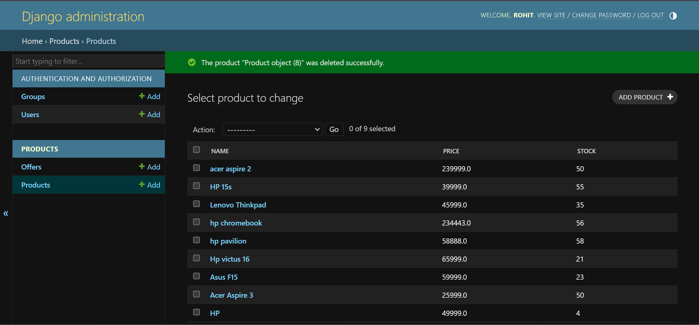
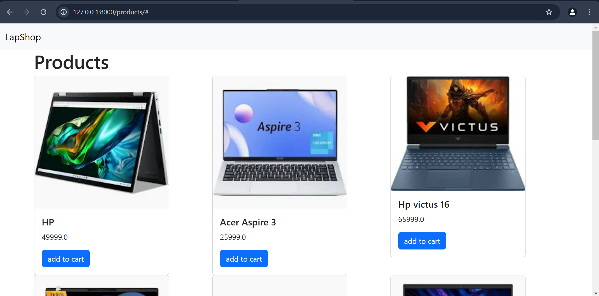

# Django E-commerce Application

This is a simple e-commerce web application built using Django. The project demonstrates fundamental concepts of Django, including models, views, and template rendering, with SQLite as the database backend.

## Project Overview

This application includes two main models:

1. **Product**: Represents a product in the e-commerce store, including its name, price, stock quantity, and image URL.
2. **Offer**: Represents special discount offers that can be applied to products.

### Models

- **Product Model**:
    - `name`: The name of the product.
    - `price`: The price of the product.
    - `stock`: The number of units available.
    - `img_url`: The URL to an image of the product.

- **Offer Model**:
    - `code`: A unique discount code.
    - `description`: A short description of the offer.
    - `discount`: The discount percentage applied by the offer.

## Features

- Basic CRUD (Create, Read, Update, Delete) functionality for managing products and offers.
- Displaying products and their details on the website.
- Applying discount codes for offers.

## Technologies Used

- **Django**: The web framework used to build the application.
- **SQLite**: The database used for storing data.
- **HTML/CSS**: For designing and rendering the web pages.
  
## Installation

1. Clone the repository:
    ```bash
    git clone https://github.com/rohitrathod2023/e-commerce-using-django.git
    ```
   
2. Navigate to the project directory:
    ```bash
    cd django-ecommerce
    ```

3. Install the required dependencies:
    ```bash
    pip install -r requirements.txt
    ```

4. Run migrations to set up the database:
    ```bash
    python manage.py migrate
    ```

5. Start the development server:
    ```bash
    python manage.py runserver
    ```

6. Visit `http://127.0.0.1:8000/products` in your browser to view the application.

## Screenshots



